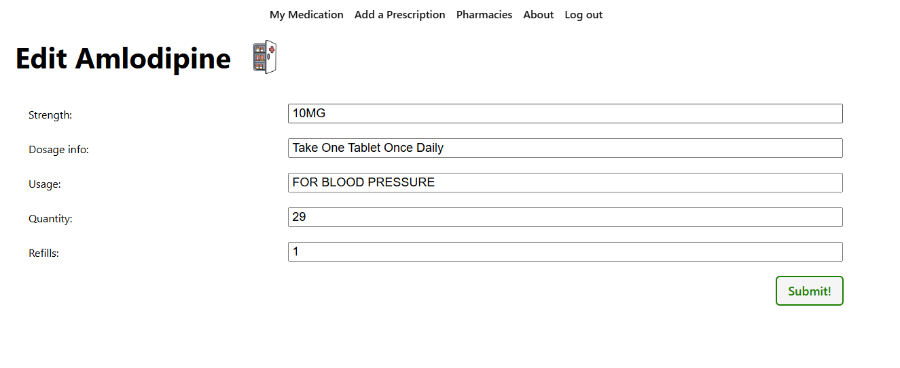

# Medication Tracker or Medicine Cabinet

# Check It Out

## Table of Contents
- [Overview](#overview)
- [Features](#features)
- [Getting Started](#getting-started)
- [Technologies Used](#technologies-used)
- [Screenshots](#screenshots)
- [Attributions](#attributions)
- [Next Steps](#next-steps)

## Overview
Medicine Cabinet is a place that you can go to keep track of all your medications.  As you take a dose, the amount of pills you have left will automatically reduce in count.  When you are below 10 pills, you will receive a message in the app to let you know that it is time to refill your medications.

## Features
- **Add Medications**: Allows the user to add a medication with doctors instructions on dosage.
- **Update Medications**: Allows the user to update their medication when their doctor updates the prescription.
- **Delete a Medication**: This feature allows the user to delete a medicaiton after the prescription runs out.
- **Pill Count**: This nice little feature allows the user to see the amount of pills remaining in the bottle.
- **Refill Notificaiton**: This handy feature alerts the user when it is time to refill.
- **Dosage Tracking**: Allows the user to see the doses he took for certain medications throughout the day.
- **Pharmacy Listing**: Gives the user a link to their local pharmacies.  Hard coded at the moment Proof of concept.

## Technologies Used
- **Django**
- **Python**
- **SQL**
- **HTML**
- **CSS**

## Screenshots

## Attributions
The images utilized in this software came from the following:
bottle.png was created in Microsoft Paint by Jerry Spann
pill-bottle.png was furnished by Fine Art of America. https://fineartamerica.com/featured/pill-bottle-on-white-background-joe-belanger.html
open-cabinet.png was provided by FREEPIX.com. https://www.freepik.com/icons/medicine-cabinet
splash.png was obtained from Clipart Library. https://clipart-library.com/clipart/559084.htm

## Next Steps
- **Real Time Pharmacy Listing**: Would like to add in the future a real time pharmacy listing.
- **Live Text or Email**: Would like to add the feature of texting or emailing user when it is time to refill medications.

